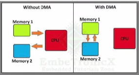

# DMA

[VIDEO HƯỚNG DẪN](https://youtu.be/Yy-MC2FphdY)

## 1. Thông thường

Thông thường, xử lý các ngoiaj vi I2C, SPI, UART, DAC,... về cơ bản cần phải thông qua CPU. Tác vụ nào CPU cũng phải thao tác xử lý

## 2. DMA

DMA - Direct memory access: được sử dụng với mục đích truyền data với tốc độ cao từ thiết bị ngoại vi đến bộ nhớ cũng như từ bộ nhớ đến bộ nhớ.

Các thao tác truyền data không cần thông qua CPU xử lý.

Ví dụ cho thấy lợi ích của DMA

- Nếu đọc 3 cảm biến analog qua DAC cho 3 cảm biến, CPU sẽ xử lý lần lượt với từng cảm biến sẽ mất thời gian

- Thay vào đó có thể dùng DMA để giao tiếp thẳng đến bộ nhớ mà ko thông qua CPU, tiết kiệm thời gian.



## 3. DMA - STM32F103C8T6

- STM32F103C8T6 chỉ có 1 bộ DMA với 7 kênh hỗ trợ cho các chức năng như: ADC, SPI, USART. I2C, TIM.

## 4. Kiểm chứng dùng DMA tăng thời gian xử lý nhanh hơn

- Dùng đọc ADC để test

### 1. Sử dụng ADC mà không dùng DMA

- config chân PA0 là ADC IN0

- config chân PA1 là chân OUTPUT

- Tạo thời gian bằng cách set chân OUTPUT mức 1 và 0 trước và sau khi xử lý đọc ADC

- Dùng analyst để phân tích xen thời gian chân ghi từ 0 - 1 - 0 kéo dài thời gian bao lâu

=> Nếu dùng 1 channel thì đã tốn vài ms, dùng thêm đến 4 channel thì mất nhiều hơn nữa.

[XEM CODE](../L01_DMA/ADC_Pooling/Core/Src/main.c)

### 2. Sử dụng ADC có dùng DMA

- config chân PA0 ADC IN0

- config chân PA1 là OUTPUT

- FLOW:

  - Khởi tạo việc đọc ADC DMA

  ```c
  HAL_ADC_Start_DMA(con trỏ ADC, (uint32_t *)biến chứa data cần truyền, uint32_t độ dài biến chứa data- độ dài data);
  ```

  - Khi hàm Start bắt đầu chạy, ADC nó đang đọc data

  - Khi ADC chạy xong, muốn copy data vào memory qua DMA, nó sẽ gọi 1 hàm callback.

  ```c
  void HAL_ADC_ConvCpltCallback(ADC_HandleTypeDef* hadc);
  ```

=> Đọc 4 channel sẽ nhanh hơn nhiều.

[XEM CODE](../L01_DMA/ADC_DMA/Core/Src/main.c)
