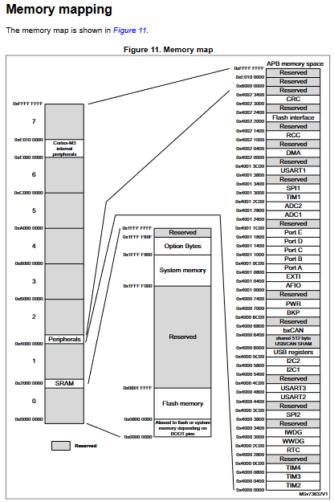
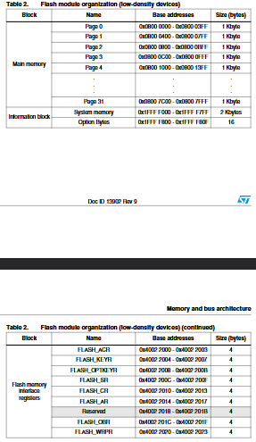

# FLASH MEMORY, ĐỌC - GHI FLASH, BOOTLOADER

## 1. Memory trong STM32F1



- Memory:

  - 64 hoặc 128 KBytes của Flash memory

  - 20 Kbyte của SRAM

| Bộ Nhớ | Địa chỉ |
| --- | --- |
| SRAM | 0x20000000 - 0x20005000 |
| FLASH | 0x08000000 - 0x0801FFFF |

## 2. SRAM và FLASH

| SRAM | FLASH |
| --- | --- |
| Tốc độ đọc ghi: nhanh | Tốc độ đọc ghi: chậm hơn |
| Dữ liệu: Bị mất khi mất điện | dữ liệu: không bị mất khi bị mất điện |
| Cấp phát: Ramdom | Cấp phát: Tĩnh |
| -------------------------- | Clear: clear theo page |

- **Page** ?

  - Bộ nhớ trong Flash được phân chia theo Page.

  - Có 128 page (0 - 127), mỗi page 1 KByte.

- Bản chất bộ nhớ Flash dùng để lưu code

## 3. Cách ghi vào FLASH

- Muốn ghi vào 1 bộ nhớ Flash cần làm theo quy trình sau:

  - Unlock Flash

  ```c
  HAL_FLASH_Unlock();
  ```

  - Erase Page

  ```c
  HAL_FLASHEx_Erase();
  ```

  - Write Data

  ```c
  HAL_FLASH_Program();
  ```

  - Lock Flash

  ```c
  HAL_FLASH_Lock();
  ```

- **Lưu ý**: không ghi đè vào các page 0, 1, 2, 3.



- Lấy địa chỉ bắt đầu của 1 page tương ứng
