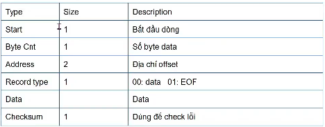
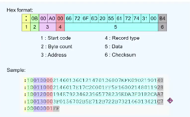

# Tìm hiểu File Hex

[XEM VIDEO](https://www.youtube.com/watch?v=omeRMG9MgK4&list=PLbQ6BBf-QSJxbv84cOCSV0LO3riGbzJfk&index=4)

## 1. Đường dẫn File Hex của project

- Mỗi khi buil 1 project, sẽ tạo ra 1 file .hex tương ứng

- File .hex nằm ở đường dẫn "..\tên project\MDK-ARM\tên project"

## 2. Cấu trúc File Hex

- Tính từ bên trái sau dấu :

## 3. Chỉ định địa chỉ của Flash để bắt đầu lưu code

Chọn Option for Target

Target

IROM1

Start : chọn giá trị địa chỉ Flash bắt đầu ghi code

**Thực chất** :

STM32 vẫn chạy bắt đầu từ địa chỉ 0x08000000

Chương trình tại 0x08000000 này sẽ chạy đầu tiên, thực hiện kiểm tra xem có 1 event nào đó sẽ có 1 con trỏ gọi đến chạy code tại giá trị địa chỉ đã set trước

Chương trình đầu tiên chạy này gọi là bootloader
