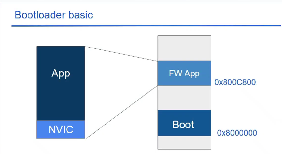

# Chương trình Boot Loader đầu tiên

[XEM VIDEO](https://www.youtube.com/watch?v=drlZiWMvIxk&list=PLbQ6BBf-QSJxbv84cOCSV0LO3riGbzJfk&index=5)

## 1. Bootloader basic

- Bootloader bản chất là 1 chương trình do người dùng viết

- Có chức năng thực thi code FW khi có 1 event xảy ra, update FW, ...

## 2. APP

- là khối code được phát triển để nạp vào FlashROM làm FW

- App sẽ có 2 phần:

  - code App

  - NVIC : vector table (SCB)

## 3. Phát triển code

Ý tưởng là bootloader sẽ là 1 chương trình xử lý event khi nó xảy ra. Ban đầu chương trình bootloader sáng led, khi có nút nhấn thì chuyển sang chương trình App thực hiện Blink 1 led

- Cũng gồm 2 phần chính:

  - Bootloader

    - Có 1 hàm để chỉ định bootloader sẽ thực hiện 1 code Application nếu có 1 event xảy ra `enter_to_application()`

    - [XEM CODE](./Bootloader/Core/Src/main.c)

  - App

    - Trong Application có chỉ định địa chỉ flash nạp code.

    - [XEM CODE](./Application/Core/Src/main.c)

## 4. Nạp Code

- Với code Bootloader thì cứ nhạp bình thường, code sẽ được nạp vào địa chỉ 0x08000000

- Với code Application thì nạp có chỉ định địa chỉ trong Target for option để chỉ định địa chỉ flash lưu code.
