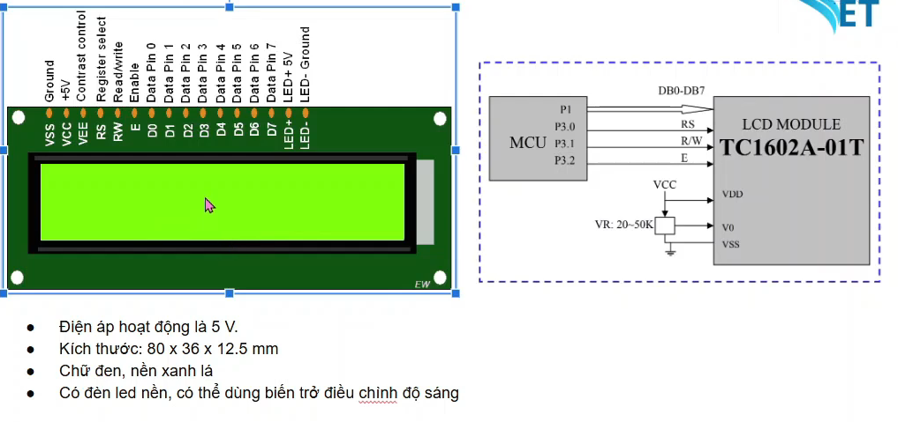
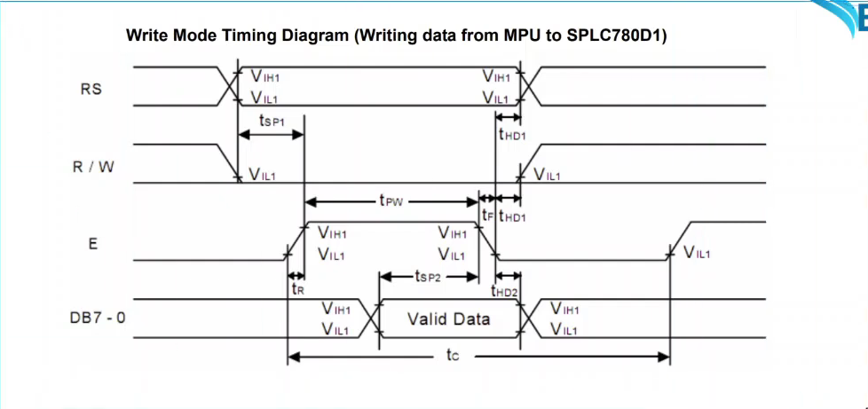
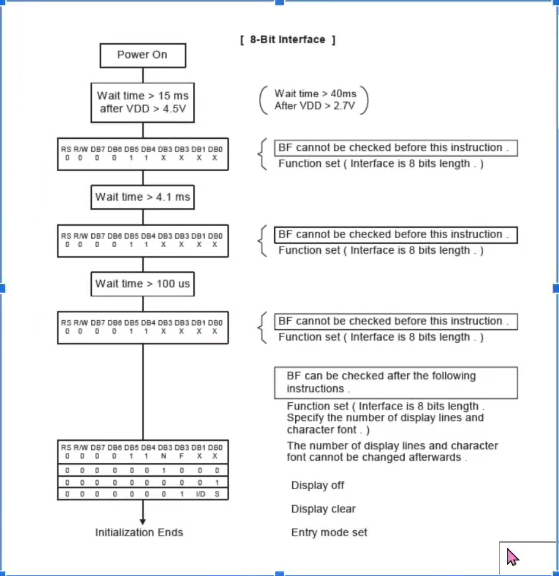
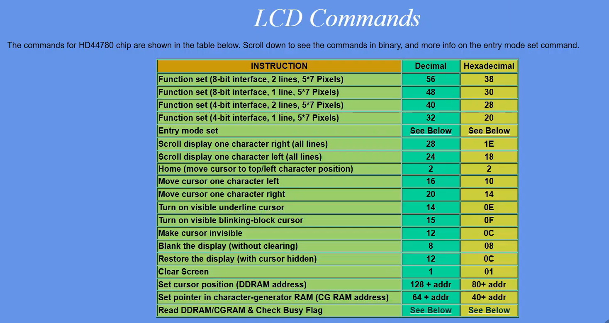

# Giao tiếp với LCD 1602 không có module I2C kèm theo

[XEM VIDEO](https://www.youtube.com/watch?v=Vu8DCRFW0Mo&list=PLbQ6BBf-QSJyMTHJihioiEOWs-FG2YxXa&index=5)

## Giới thiệu LCD 1602



1. Có 16 cột 2 hàng

2. Điện áp hoạt động là 5V

3. Chữ đen, nền xanh

4. Có đèn led nền, có thể dùng biến trở để điều khiển độ sáng

5. Các chân:
    - VSS -> GND
    - VDD -> 5V
    - V0 : độ sáng màn hình, thường mắc vào biến trở
    - RS : địa chỉ sẽ được ghi dữ liệu
    - RW : Read or Write
    - E : Cho phép ghi vào LCD
    - D0-7 : Dữ liệu truyền
    - LED+ LED- : On Off màn hình LCD

## Gửi dữ liệu với LCD

### 1. Ghi vào LCD

- Chân RS = 0 nếu gửi lệnh (Command), RS = 1 nếu gửi data

- Chân RW : kéo xuống 0 ghi dữ liệu

- Các chân D0-7 : khi ghi dữ liệu, các chân này sẽ ở chế độ input, chân MCU kết nối vào ở chế độ output

- Chân E sẽ được kéo lên 1 để ghi dữ liệu, sau đó nhả về 0

### 2. Gửi dữ liệu với LCD

- [Theo datasheet](https://cdn-shop.adafruit.com/datasheets/TC1602A-01T.pdf)

- Timing diagram



## Khởi tạo LCD

Chế độ 8 bit



## Config GPIO

| MCU | LCD |
| :-- | :-- |
| PA0 | D0 |
| PA1 | D1 |
| PA2 | D2 |
| PA3 | D3 |
| PA4 | D4 |
| PA5 | D5 |
| PA6 | D6 |
| PA7 | D7 |
| PA8 | D8 |
| PA9 | D9 |
| PB0 | RS |
| PB1 | RW |
| PB10 | E |

## Kết nối LCD với STM32F103C8T6

| LCD | STM32F103C8T6 |
| :-- | :-- |
| VSS | GND |
| VCC | 5V |
| RS | PB0 |
| RW | PB1 |
| E | PB10 |
| D0 | PA0 |
| D1 | PA1 |
| D2 | PA2 |
| D3 | PA3 |
| D4 | PA4 |
| D5 | PA5 |
| D6 | PA6 |
| D7 | PA7 |
| LED+ | 5V |
| LED- | GND |

## Kết nối biến trở với nguồn và LCD

| LCD | Biến trở | Nguồn |
| :-- | :-- | :-- |
| - | 3 | GND |
| - | 1 | 5VDC |
| VEE | 2 | -|

## Code



```c
#define MDATA 0x01
#define MCMD 0x00

void LCD_Init();

void LCD_Write_Byte(uint8_t data, uint8_t mode);

void LCD_Write_(uint8_t data);

void LCD_Write_cmd(uint8_t data);

void LCD_Print(char *str);

void LCD_Init() {
    HAL_GPIO_WritePin(GPIOB, GPIO_PIN_1, 0);

    HAL_Delay(50);
    LCD_Write_cmd(0x38); // set 8 bit 2 lines 5*7 pixels
    HAL_Delay(5);
    LCD_Write_cmd(0x0C); // cursor hidden
    HAL_Delay(5);
    LCD_Write_cmd(0x01); // clear screen
    HAL_Delay(5);
    LCD_Write_cmd(0x06); // display from left to 
}

void LCD_Write_Byte(uint8_t data, uint8_t mode) {
    if (mode == 0x01) {
        // data
        HAL_GPIO_WritePin(GPIOB, GPIO_PIN_0, 1); // RS = 1
    } else if (mode == 0x00) {
        // cmd
        HAL_GPIO_WritePin(GPIOB, GPIO_PIN_0, 0); // RS = 0
    }

    // ghi data ra chân GPIO
    HAL_GPIO_WritePin(GPIOA, GPIO_PIN_0, (data & 0x01) ? 1 : 0);
    HAL_GPIO_WritePin(GPIOA, GPIO_PIN_1, (data & 0x02) ? 1 : 0);
    HAL_GPIO_WritePin(GPIOA, GPIO_PIN_2, (data & 0x04) ? 1 : 0);
    HAL_GPIO_WritePin(GPIOA, GPIO_PIN_3, (data & 0x08) ? 1 : 0);
    HAL_GPIO_WritePin(GPIOA, GPIO_PIN_4, (data & 0x10) ? 1 : 0);
    HAL_GPIO_WritePin(GPIOA, GPIO_PIN_5, (data & 0x20) ? 1 : 0);
    HAL_GPIO_WritePin(GPIOA, GPIO_PIN_6, (data & 0x40) ? 1 : 0);
    HAL_GPIO_WritePin(GPIOA, GPIO_PIN_7, (data & 0x80) ? 1 : 0);

    // delay 1 khoảng theo datasheet để truyền data
    HAL_GPIO_WritePin(GPIOB, GPIO_PIN_10, 0);
    HAL_Delay(1);
    HAL_GPIO_WritePin(GPIOB, GPIO_PIN_10, 1);
    HAL_Delay(1);
    HAL_GPIO_WritePin(GPIOB, GPIO_PIN_10, 0);
    HAL_Delay(1);
}

void LCD_Write_data(uint8_t data) {
    LCD_Write_Byte(data, 1);
}

void LCD_Write_cmd(uint8_t data) {
    LCD_Write_Byte(data, 0);
}

void LCD_Print(char *str) {
    while(*str) {
        LCD_Write_data(*str++);
    }
}

int main() {
    LCD_Init();
    LCD_Print('Hello');
    while(1){

    }
}
```

## Viết thư viện cho LCD để có thể tái sử dụng

[XEM VIDEO](https://www.youtube.com/watch?v=rNwzil5Cm9E&list=PLbQ6BBf-QSJyMTHJihioiEOWs-FG2YxXa&index=6)

- Tạo Folder và các file.h/.c cho thư viện

  - Mở folder có đường dẫn đến thư mục chứa project (đường dẫn nằm ở góc trái trên Keil C)

  - Tạo 1 folder chứa code thư viện

  - Trong folder này tạo 2 file.h/.c cho thư viện

  - Quay lại Keil C

  - Chuột phả vào folder project trên Keil C, chọn Add Group sẽ xuất hiện 1 folder mới có tên là New Group

  - New Group -> chuột phải chọn Manager Project Items...

  - Đổi tên thư mục New Group theo như folder thư viện

  - Sao đó, nhấn Add File và tìm đến folder thư viện đã tạo trên máy để chọn 2 file.h/.c add vào (chọn All File để thấy được tất cả các file)

- Cấu hình đường dẫn đến thư mục chứa file thư viện

  - Chuột phải vào folder project -> chọn Option for target...

  - Ở tab C/C++ (AC6), tại mục Include Paths, thêm đường dẫn đến folder chứa thư viện

  - Nhấn OK để chấp nhận

- Mở folder thư viện

- Code
