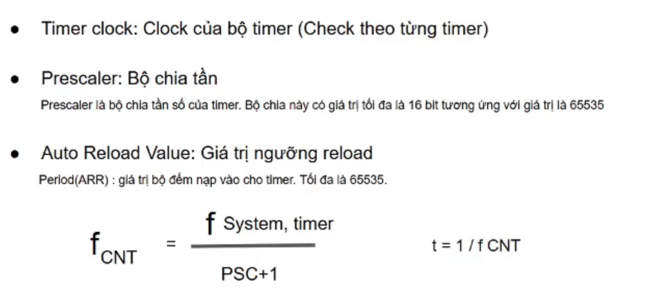

# TIMER VỚI STM32

## [XEM VIDEO](https://www.youtube.com/watch?v=l-kNWOs0-98&list=PLbQ6BBf-QSJyMTHJihioiEOWs-FG2YxXa&index=10)

## [TÀI LIỆU CÁC THANH GHI TRÊN STM32F103C8T6](../../Doc/stm32f10xxx.pdf)

## 1. Giới thiệu Timer

- `Timer` đơn giản là 1 bộ hẹn giờ (`bộ định thời`)

- Đối với chip STM32F103C8T6 có tất cả 4 bộ Timer từ Timer 1 đến Timer 4:

  - Timer 1: Advance - control timer (nhiều chức năng hơn các Timer còn lại) (`thanh ghi APB2`)

  - Timer 2, Timer 3, Timer 4: general purpose timer (`thanh ghi APB1`)

## 2. Cơ chế

- Nguyên lý hoạt động của `Timer` trên STM32:

  - `Timer` là 1 bộ đếm độc lập so với CPU. Cứ sau 1 lượng thời gian `t` (thời gian này có thể lập trình được) thì giá trị của `thanh ghi CNT` (thanh ghi đếm) của `Timer` sẽ tăng lên 1 đơn vị. Khi giá trị đếm bằng với giá trị trên `thanh ghi ARR` (thanh ghi đặt trước thời gian đếm) thì `bộ đếm sẽ reset về 0` (`thanh ghi CNT reset về 0`), đồng thời `chương trình sẽ sinh ra 1 ngắt cập nhật`.

  

- Các thanh ghi quản lý bao gồm:

  - Counter Register (`TIMx_CNT`) : lưu giá trị đếm

  - Prescater Register (`TIMx_PSC`) : Lưu giá trị chia từ tần số cơ sở cấp cho Timer đẻ tạo ra tần số thích hợp

  - Auto-Reload Registor (`TIMx_ARR`) : lưu giá trị đích đếm lên hoặc đếm xuống

## 3. Ngắt Timer 500ms

- Cách Setup

  - Để đưa tần số đếm về 1KHz, chọn PSC bằng 63999

  - Sau đó tính t = 1ms => sau 1ms thanh ghi CNT sẽ tăng 1 đơn vị



- Sau khi tạo project như trong video hướng dẫn, thực hiện code

  - Bật ngắt timer lên bằng API chuẩn `HAL_TIM_Base_Start_IT();` cho timer tự động chạy

  ```c
  HAL_TIM_Base_Start_IT(TIM_HandleTypeDef *htim);
  ```

  - Trong đó:

    - `TIM_HandleTypeDef *htim` : là đối tượng đã được khởi tạo tương ứng với timer khi tạo project.

    - Khi truyền thì truyền tham chiếu vì cần truyền con trỏ
  
  - Sau khi timer chạy, thanh ghi CNT == thanh ghi ARR thì gọi đến hàm xử lý ngắt `void TIM1_UP_IRQHandler(void)` trong file `./04_Timer500ms/Core/Src/stm32f1xx_it.c`

  - Trong hàm này gọi hàm ngắt `HAL_TIM_IRQHandler(&htim1);`
  
  - Trong hàm ngắt gọi đến hàm callback `void HAL_TIM_PeriodElapsedCallback(TIM_HandleTypeDef *htim)` trong file `./04_Timer500ms/Drivers/STM32F1xx_HAL_Driver/Src/stm32f1xx_hal_tim.c` để sử lý task

  - Copy nguyên mẫu hàm callback vào `./04_Timer500ms/Core/Src/main.c` để bắt đầu xây dựng task khi ngắt timer

  ```c
  void HAL_TIM_PeriodElapsedCallback(TIM_HandleTypeDef *htim) {
    // task khi ngắt timer xảy ra

  }
  ```

## Xây dựng hàm Delay_us, Delay_ms không dùng ngắt

### [XEM VIDEO](https://www.youtube.com/watch?v=_MocLhGA5MQ&list=PLbQ6BBf-QSJyMTHJihioiEOWs-FG2YxXa&index=11)

- Xây dựng hàm Delay_us

  - Cần set PSC là 63 => t = 1us.

  - Không cần set giá trị cho thanh ghi ARR vì không cần dùng ngắt timer

- Xây dựng hàm Delay_ms

  - Là hàm Delay_us * 1000

## Xây dựng code đọc DHT11

### [XEM VIDEO](https://www.youtube.com/watch?v=spyKGp61ySs&list=PLbQ6BBf-QSJyMTHJihioiEOWs-FG2YxXa&index=12)

- Dùng Timer thường chứ không dùng ngắt Timer

- Để kích hoạt bắt đầu dùng Timer thường

```c
HAL_TIM_Base_Start(&htim2);
```

- Để chỉ định giá trị Reset counter cho thanh ghi CNT, có thể truy cập trực tiếp bằng cách dùng đối tượng Instance và trỏ đến thanh ghi CNT và gán giá trị cho nó

```c
htim2.Instance->CNT = 0;
```

- Nó tương đương với

```c
__HAL_TIM_SET_COUNTER(&htim2, 0);
```

- Để đọc giá trị trong thanh ghi CNT, có thể truy cập trực tiếp bằng cách dùng đối tượng Instance và trỏ đến thanh ghi CNT và đọc giá trị của nó, lưu vào 1 biến hoặc không cần

```c
uint16_t count = htim2.Instance->CNT;
```

- Nó tương đương với

```c
uint16_t count = __HAL_TIM_GET_COUNTER(&htim2);
```

- Để dừng việc dùng Timer thường

```c
HAL_TIM_Base_Stop(&htim2);
```

## [XEM CODE](./04_Timer500ms/Core/Src/main.c)
