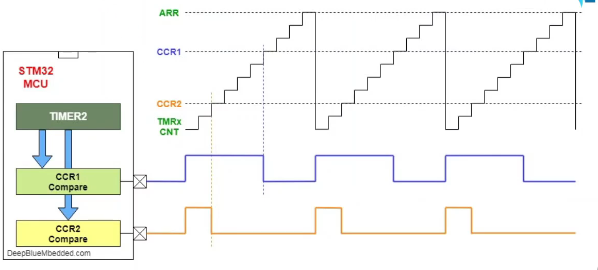

# PWM TRÊN STM32

## [XEM VIDEO](https://www.youtube.com/watch?v=xjxp3c-Qjq4&t=1s)

## 1. Giới thiệu

- Đối với GPIO trên STM32:

  - Mức 0: 0V

  - Mức 1: 3.3V

- Nếu muốn xuất 2V ra GPIO thì sao?

-> Giải pháp là sử dụng PWM

- PWM (Pulse Width Modulation) là phương pháp điều chỉnh độ rộng xung có chu kỳ cố định, nhằm tạo ra sự thay đổi điện áp đầu ra.

- PWM áp dụng kiến thức của Timer

- Trong mỗi Timer có 4 kênh độc lập phát PWM

- Chu kỳ xung của PWM được quản lý bằng thanh ghi PSC và thanh ghi ARR

- Duty Cycles được quản lý bằng thanh ghi CCR

- Ứng dụng: Timer có thể tạo xung PWM để điều khiển độ sáng của LED, tốc độ động cơ hoặc điều chế tín hiệu.

## 2. Độ rộng xung - Duty Cycles

- Các công thức:

  - T = Ton + Toff

  - DC = Ton / T

  - Vout = DC * 3.3V

- Áp dụng với thanh ghi:

  - Thanh ghi CCR là Ton

  - Thanh ghi ARR là Tpwm

## 3. Thực hành điều khiển SG90

### [XEM VIDEO](https://www.youtube.com/watch?v=FeOoPGNq4to)

- Áp dụng Timer, cấu hình làm sao cáu hình cho t = 1ms (Ttime = 64M,Tpwm = 20ms).

  - t = Ttimer / PSC + 1

  - ARR = (Tpwm / t) - 1

  -> Chọn PSC = 63 => t = 1us, ARR = 19999

- Bản chất T = 20ms là ARR = 20000

=> Ton = 1ms thì CCR = 1000 (0 degre)

=> Ton = 1.5ms thì CCR = 1500 (90 degre)

=> Ton = 2ms thì CCR = 2000 (180 degre)

=> Công thức tính CCR = (1000*degre) / 180 + 1000

## [XEM CODE](./05_PWM/Core/Src/main.c)
