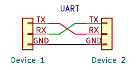
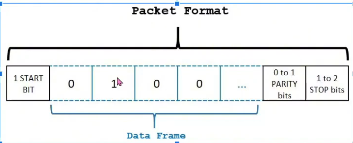
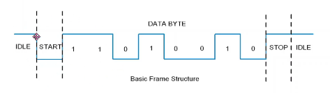

# UART TRÊN STM32

## 1. Khái niệm



- Gồm 3 chân:

  - TX : Transmitter : gửi dữ liệu từ thiết bị này đến thiết bị khác

  - RX : Receiver : nhận dữ liệu từ thiết bị khác

  - GND : đất : nối chung để làm điện áp tham chiếu

## 2. Thông số



- Start bit: thường là 1 bit, xác định bắt đầu của gói dữ liệu

- Data Frame : Tùy thuộc vào cấu hình, thường là 7, 8, 9 bit

- Parity bit (Tùy chọn) : Dùng để kiểm tra lỗi trong quá trình truyền dữ liệu

- Stop bits : 1 hoặc 2 bit dùng để báo hiệu kết thúc của gói dữ liệu



## 3. Setup để giao tiếp UART laptop với STM32

- Mua board USB CH340 và cài driver cho nó

- Cài phần mềm `Hercules` để giả lập laptop là 1 VĐK

## 4. Code Truyền data (Transmitter)

- 1 Project code

### [XEM VIDEO](https://www.youtube.com/watch?v=bGK-tU7XWFc&list=PLbQ6BBf-QSJyMTHJihioiEOWs-FG2YxXa&index=17)

- API dùng để truyền data

```c
HAL_UART_Transmit(&huart1, str, strlen(str), 500);
```

- Trong đó:

  - &huart1 : đối tượng uart được tạo ra khi cấu hình trên STM32CubeMX

  - str : là con trỏ, chứa dữ liệu, phải là kiểu dữ liệu con trỏ uint8_t

  - strlen(str) : kích thước của dữ liệu

  - 500 : Timeout

### [XEM CODE](./07_UART_Transmitter/Core/Src/main.c)

## Check xung

- [Mua thiết bị logic anal](https://hshop.vn/mach-usb-saleae-8ch-24mhz-logic-analyzer)

- [Download phần mềm](https://saleae.com/downloads)

=> Giả lập được máy oscilliscope trên laptop

## 5. Code nhận Data (Receiver)

- 1 Project code khác

### [XEM VIDEO](https://www.youtube.com/watch?v=1MEDOasmXF0&list=PLbQ6BBf-QSJyMTHJihioiEOWs-FG2YxXa&index=19)

- Việc nhận data không phải lúc nào cũng chờ để nhận, mà chỉ nhận khi có tín hiệu ngắt yêu cầu nhận

- Dùng API chuẩn để nhận data qua ngắt

```c
HAL_UART_Receive_IT(&huart1, myData, 1);
```

- Trong đó:

  - &huart1: đối tượng uart được tạo ra khi tạo project

  - myData: chuỗi data, là con trỏ uint8_t

  - 1 : kích thước nhận chuỗi data là 1 byte

- Gọi API hàm callback của ngắt

```c
void HAL_UART_RxCpltCallback(UART_HandleTypeDef *huart) {
  // do something
}
```

### [XEM CODE](./07_UART_Receiver/Core/Src/main.c)
