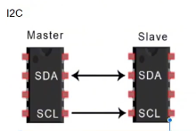
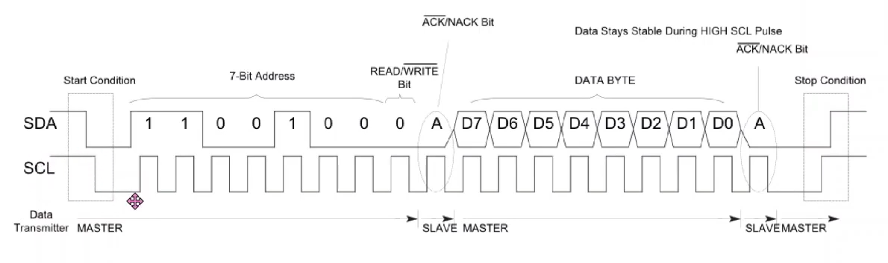
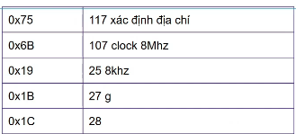
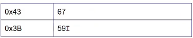

# I2C TRÊN STM32



##

### [XEM VIDEO](https://www.youtube.com/watch?v=KUcw2TBnrT4&list=PLbQ6BBf-QSJyMTHJihioiEOWs-FG2YxXa&index=19)

## 1. Cách hoạt động

- Khung truyền



## 2. Cách I2C đọc và ghi dữ liệu

### 2.1. Ghi

- B1 : Master gửi tín hiệu Start I2C

- B2 : Master gửi địa chỉ của thiết bị I2C (7 bit) kèm theo 1 bit Write (bit 0)

- B3 : Master gửi địa chỉ của thanh ghi dữ liệu của Slave muốn ghi giá trị

- B4 : Master gửi giá trị mà muốn ghi vào thanh ghi ở bước 3

- B5 : Master tạo tín hiệu Stop

### 2.2. Đọc

- B1 : Master gửi tín hiệu Start I2C

- B2 : Master gửi địa chỉ của thiết bị I2C (7 bit) kèm theo bit Write (bit 0)

- B3 : Master gửi địa chỉ thanh ghi của Slave mà muốn đọc dữ liệu

- B4 : Master gửi tín hiệu Repeated Start

- B5 : Master gửi địa chỉ của thiết bị I2C (7 bit) kèm theo 1 bit Read (bit 1)

- B6 : Master đọc dữ liệu chứa trong thanh ghi ở B3 từ Slave gửi về

- B7 : Master tạo tín hiệu Stop

## 3. Các API chuẩn với HAL

- Truyền data từ Master thông qua I2C mà không chỉ định địa chỉ thanh ghi. Do đó phải tốn 2 lần dùng: 1 lần để chỉ định địa chỉ thanh ghi, 1 lần gửi data để ghi vào thanh ghi.

```c
HAL_I2C_Master_Transmit(*hi2c, unit16_t DevAddress, uint8_t *pData, uint16_t Size, uint32_t Timeout);
```

- Truyền data từ Master thông qua I2C có chỉ định địa chỉ thanh ghi của Slave. Gộp 2 lần gửi địa chỉ và gửi data lại với nhau

```c
HAL_I2C_Mem_Write(*hi2c, unit16_t DevAddress, uint16_t MemAddress, uint16_t MemAddSize, uint8_t *pData, uint16_t Size, uint32_t Timeout);
```

- Tương tự có hàm dùng để đọc dữ liệu

```c
HAL_I2C_Master_Receive();
```

```c
HAL_I2C_Mem_Read();
```

## 4. Cảm biến MPU6050

### [XEM VIDEO](https://www.youtube.com/watch?v=gfTzPps6F7M&list=PLbQ6BBf-QSJyMTHJihioiEOWs-FG2YxXa&index=20)


[Datasheet](../../Doc/MPU-6000.PDF)

- Target: đọc được giá trị của 2 góc

  - pitch : góc đổ lên hoặc đổ xuống

  - Roll : góc xoay trái hoặc xoay phải

=> Sau đó điều khiển được bánh xe để điều khiển xe cân bằng

- Flow như sau:

  - MPU6050 -> Đọc gyroscope (g), gia tốc kế (a) -> Đọc được góc pitch (p), góc Roll (R) -> PWM -> Điều khiển động cơ bánh xe -> Xe cân bằng.

### 4.1. MPU6050 Init

- Các thanh ghi khởi tạo cảm biến



- Các thanh ghi đọc G & A



### 4.2. MPU6050_ReadData

#### [XEM VIDEO](https://www.youtube.com/watch?v=x9RQa-uL3lk&list=PLbQ6BBf-QSJyMTHJihioiEOWs-FG2YxXa&index=21)

## [XEM CODE](./08_I2C_MPU6050/Core/Src/main.c)
