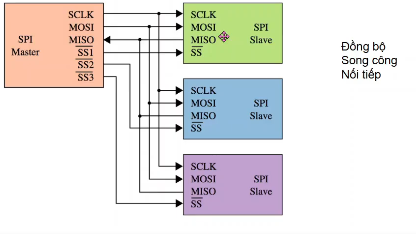
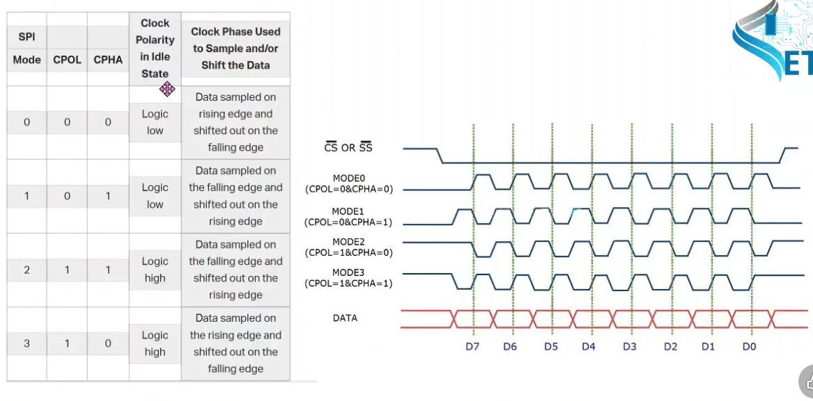
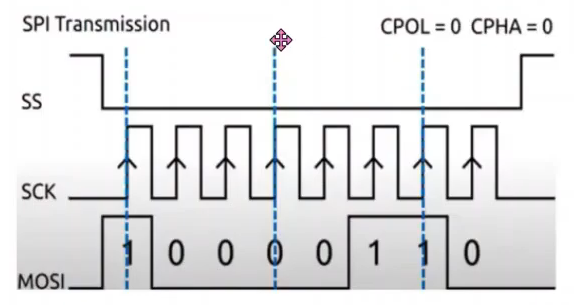

# SPI TRÊN STM32

## [XEM VIDEO](https://www.youtube.com/watch?v=0Wq5z_cHw4c&list=PLbQ6BBf-QSJyMTHJihioiEOWs-FG2YxXa&index=22)

## 1. Giới thiệu



- Đây là kiểu truyền thông Master-Slave trong đó Master điều phối quá trình truyền thôg và các Slave được điều khiển bởi Master

- CLK thường được chọn < F VĐK / 4

- Giao thức SPI tồn tại 4 Mode truyền dữ liệu:

  
  
  - CPOL = 0 : khi xung dẫn đầu của 1 chu kỳ là xung cạnh lên, xung còn lại là xung cạnh xuống.

  - CPOL = 1 : khi xung dẫn đầu của 1 chu kỳ là xung cạnh xuống, xung còn lại là xung cạnh lên.

  - CPHA = 0 : khi bit dữ liệu đầu ra đúng với cạnh xung SCK còn lại, còn cạnh xung dẫn đầu rơi vào khoảng giữa của bit dữ liệu

  - CPHA = 1 : khi bit dữ liệu đầu ra đúng với cạnh xung SCK dẫn đầu, còn cạnh xung còn lại rơi vào khoảng giữa của bit dữ liệu

## 2. Cách giao tiếp



- Mỗi chip Master hay Slave có 1 thanh ghi dữ liệu 8 bit. Cứ mỗi xung nhịp của Master, 1 bit trong thanh ghi dữ liệu của Master sẽ được truyền qua Slave theo đường MOSI, đồng thời 1 bit trong thanh ghi dữ liệu của Slave cũng được truyền qua Master theo đường MISO

## 3. Code Truyền data

- Truyền/ ghi/ xuất dữ liệu từ Master ra:

  - Trước khi truyền SPI, chân CS mặc định phải là mức cao

  - Cần phải kéo chân CS xuống mức thấp để cho phép Slave đó giao tiếp với Master

  - Sau đó truyền dữ liệu bằng API chuẩn

    - Trong đó:

      - &hspi1 : là 1 con trỏ được tạo ra trong khi tạo project

      - &data : là 1 con trỏ chứa chuỗi data cần truyền đi

      - 1 : kích thước chuỗi data là 1 byte

      - 1000 : là thời gian Timeout

  ```c
  HAL_SPI_Transmit(&hspi1, &data, 1, 1000);
  ```

  - Sau khi truyền xong, trả chân CS lên cao để kết thúc quá trình truyền

## 4. Code màn hình TFT LCD ST7735 P1

### [XEM VIDEO](https://www.youtube.com/watch?v=faYsS6iAe1w&list=PLbQ6BBf-QSJyMTHJihioiEOWs-FG2YxXa&index=23)

[datasheet](../../Doc/TFT-LCD-ST7735.pdf)

- Code để có thể hiển thị màu full trên màn hình

## 5. Code hiển thị text trên TFT

### [XEM VIDEO](https://www.youtube.com/watch?v=UKMLCkc_CB0&list=PLbQ6BBf-QSJyMTHJihioiEOWs-FG2YxXa&index=24)

- Code để hiển thị text, image lên TFT

- [Lấy mẫu font ký tự 7x10 TFT LCD ST7735 trên github](https://github.com/Dungyichao/STM32F4-LCD_ST7735s/blob/master/ST7735/fonts.c)

- [Lấy màu của pixel](https://rgbcolorpicker.com/565)

## [XEM CODE](./09_SPI_TFT/Core/Src/main.c)
